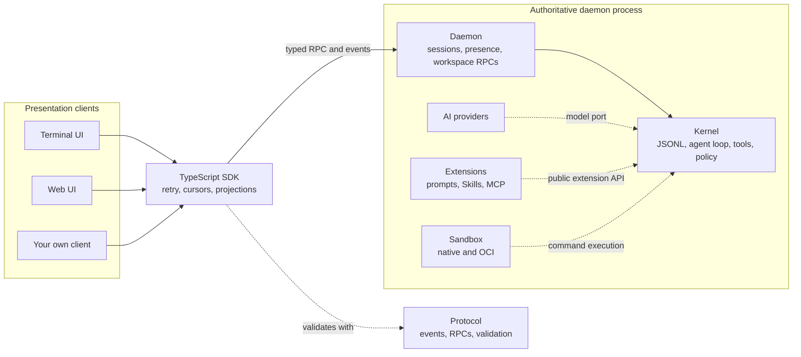

<!-- SPDX-FileCopyrightText: 2026 Hari Srinivasan -->
<!-- SPDX-FileCopyrightText: 2026 Lokesh -->
<!-- SPDX-FileCopyrightText: 2026 Srihari -->
<!-- SPDX-FileCopyrightText: 2026 Shaan Narendran -->
<!-- SPDX-License-Identifier: Apache-2.0 -->

<p align="center">
  
</p>

<pre>
 █████╗ ██╗  ██╗██╗
██╔══██╗╚██╗██╔╝██║
███████║ ╚███╔╝ ██║
██╔══██║ ██╔██╗ ██║
██║  ██║██╔╝ ██╗███████╗
╚═╝  ╚═╝╚═╝  ╚═╝╚══════╝
</pre>

**Axl is a local-first agent harness: one daemon owns your coding session, and every client is a window into it.**

<p>
  <a href="LICENSE"></a>
  
  
  <a href="https://github.com/Observal/Axl/actions/workflows/ci.yml"></a>
  <a href="https://github.com/Observal/Axl/graphs/contributors"></a>
  <a href="https://github.com/Observal/Axl/stargazers"></a>
  <a href="https://discord.gg/SFPjnTWddk"></a>
</p>

> Axl is short for Axolotl. If you find it useful, please consider giving it a star. It helps others find the project.

---

## What is Axl and what does it solve?

Most agent harnesses tie a session to the client that started it. Close the terminal and the work stops. Open a browser and you get a second agent with its own loop, tools, and history. Provider code leaks into the core, and sandboxing is whatever the client happened to implement.

Axl takes the opposite approach:

1. **One authority per session.** A single daemon owns the model loop, tools, policy, and canonical event history. Terminal, browser, and SDK clients render the same state and submit intent. None of them is an independent agent.
2. **Isolation that fails closed.** Model-selected commands run in Bubblewrap, Landlock, seccomp, Seatbelt, or a rootless OCI container. If the isolation you asked for is unavailable, Axl refuses to run instead of downgrading.

Everything the model sees is recorded in an append-only JSONL log, so sessions resume after a crash, replay deterministically, and can be audited.

### Why developers use Axl

- **Durable sessions:** Detach, close your laptop, reconnect from another client, or resume after a daemon restart.
- **Terminal and browser, same session:** `axl` and `axl web` attach to one daemon and show the same history.
- **Your models:** Over 35 built-in providers, plus any OpenAI-compatible endpoint, with provider code kept out of the kernel.
- **Sandboxed by default:** File, shell, and web tools run under enforced OS-level isolation.
- **Control while it works:** Steer mid-turn, queue follow-ups, interrupt, or detach without losing accepted work.
- **Extensible without bloat:** Agent Skills, MCP, prompt templates, and daemon extensions load on demand, so unused features add nothing to the prompt.
- **Build your own client:** A typed SDK handles reconnects, cursors, and projections for you.

---

## Quick start

Axl requires Node.js `^22.19.0` or `>=24`. Linux needs Bubblewrap for native sandboxing. macOS uses Seatbelt. Rootless Podman or Docker is optional.

### 1. Install

```bash
git clone https://github.com/Observal/Axl.git && cd Axl
pnpm install --frozen-lockfile
pnpm run install:cli
```

See [SETUP.md](SETUP.md) for requirements and platform notes.

### 2. Connect a model

```bash
axl providers            # list providers and authentication status
axl models openai        # list models for one provider
axl login openai api_key
```

### 3. Start a session

```bash
axl                      # terminal UI
axl web                  # browser UI over the same daemon
```

The CLI connects to the matching local daemon and starts one if needed. Run `/commands` for actions and `/hotkeys` for keyboard controls inside the UI.

```bash
axl -r                          # pick a saved session
axl <session-id>                # resume a known session
axl --cwd ~/code/project        # choose the workspace
axl --profile exec              # sandboxed Bash only
axl doctor                      # check local sandbox support
axl print "describe this repo"  # one headless response
axl json "describe this repo"   # canonical events as JSONL
axl rpc                         # JSONL RPC over stdin and stdout
```

---

## How Axl works



Every operation takes the same path:

1. A client submits typed user intent.
2. The daemon validates capability, policy, and operation ownership.
3. The kernel performs the operation.
4. The canonical event is appended before any derived state changes.
5. Every subscribed client receives and projects the same event.

Boundaries are deliberate. The protocol has no dependencies. The kernel depends only on the protocol and Node.js. Provider behavior lives in `packages/ai`. Clients never own loops, tools, policy, or history. See [Client authority and adapter boundaries](docs/architecture/client-boundaries.md).

### Sessions belong to the daemon

- `/detach` closes the client and leaves the session running.
- `/quit` interrupts work, flushes history, and stops the daemon.
- Escape interrupts without exiting.
- Resume uses a frozen, paged snapshot followed by an acknowledged live stream. Gaps are detected and repaired from an authoritative snapshot.
- Restart recovery reconciles accepted operations against the canonical log before serving clients.

### Steering and follow-ups

While a turn is active, **Enter** sends steering that lands at the next model boundary, and **Alt+Enter** queues a follow-up that runs when the turn would otherwise end. Both are FIFO, and steering wins at each boundary. Durable queued prompts are recorded before acknowledgement and pause after a restart, so Axl never guesses whether deferred work should run again.

---

## What works today

| Area | Capability |
| --- | --- |
| Sessions | Create, list, resume, fork, clone, interrupt, detach, reconnect, compact, configure, dispose |
| Durability | Append-only JSONL, operation IDs, crash-safe journal, restart reconciliation, deterministic replay |
| Clients | Terminal UI, local web UI, headless `print`, `json`, and `rpc`, and a typed SDK |
| Models | Over 35 providers, provider-qualified selection, usage and cost reporting, streaming text and reasoning |
| Tools | `read`, `write`, `edit`, `bash`, `web_fetch`, `web_search` |
| Extensions | Agent Skills, MCP 2025-11-25 (stdio and Streamable HTTP), prompt templates, daemon extensions |
| Workspace | Bounded file listing and reads, Git status, structured diffs, last-turn checkpoints |
| Isolation | Bubblewrap, Landlock, seccomp, and rlimits on Linux; Seatbelt on macOS; rootless Podman or Docker |
| Safety | Path canonicalization, symlink-escape rejection, secret redaction, bounded messages |
| Extras | Axolotl mascot that reflects session state, and Axl Lounge word and puzzle games for waiting on long turns |

---

## Terminal and web clients

The terminal UI has Unicode-aware multiline editing, searchable history, themes, model and thinking controls, retained tool cards with diff previews, image attachments, regular and fullscreen modes, optional Vim editing, and MCP approval dialogs.

The web client is a responsive, static React app served by an authenticated loopback gateway. Run `axl web` to open it. It supports session selection, synchronized history, split panes, a command palette, model picker, workspace changes, and the same controls the daemon grants the terminal. Closing the browser detaches only that browser.

Both clients use only the public SDK. See [web client architecture](docs/architecture/web-client.md) and [gateway security](docs/architecture/web-gateway-security.md).

---

## Models

Axl ships with providers including OpenAI, Anthropic, Google, Vertex, Amazon Bedrock, GitHub Copilot, xAI, DeepSeek, Mistral, Groq, OpenRouter, Cloudflare, Fireworks, Together, Hugging Face, Moonshot, Z.ai, MiniMax, Qwen, and OpenCode. Add local or hosted endpoints in `~/.axl/models.json`.

```bash
axl providers      # offline listing
axl login <id>     # API key or OAuth
axl refresh        # explicit catalog refresh
```

Provider secrets never pass through daemon RPC, the SDK, or canonical events. See the [provider reference](docs/provider-support/provider-reference.md) for every environment variable, endpoint, region, and limitation.

---

## Sandboxing

Axl refuses to run model-selected commands when required isolation is unavailable.

| Backend | Mechanism |
| --- | --- |
| Linux | Bubblewrap namespaces, Landlock, versioned seccomp policy, dropped capabilities, resource limits |
| macOS | Seatbelt, with unavailable controls reported explicitly |
| OCI | Rootless Podman or Docker with seccomp and cgroups v2, digest-pinned images only |

```bash
axl --sandbox podman --image docker.io/library/bash@sha256:<64-hex-digest>
```

`axl --unsafe` disables OS isolation and file-tool path policy. Unsafe sessions use separate state and stay visibly labeled. See [sandbox backends](docs/architecture/sandbox-backends.md) and the [security policy](SECURITY.md).

### Session profiles

| Profile | Purpose |
| --- | --- |
| `standard` | Normal coding session with built-in tools and extensions |
| `minimal` | Small tool surface for focused work |
| `chat` | Tool-free conversation |
| `exec` | Bash only, with no Skills, MCP, file tools, or web tools |

See [session profiles](docs/session-profiles.md).

---

## Extending Axl

First-party and third-party features share one public extension API. Disabled features add no prompt content, UI, or background work.

- **Project instructions:** `AGENTS.md` files from the repository root to the working directory, recorded in the session log.
- **Agent Skills:** Discovered from `~/.axl/skills/`, `~/.agents/skills/`, and project `.axl/skills/` and `.agents/skills/`. The model finds and activates them through one `capability_search` tool.
- **MCP servers:** Run `/mcp` to paste a server's README config. Axl probes the server before saving it.
- **Prompt templates:** Markdown files in `~/.axl/prompts/` or `.axl/prompts/`, run with `/prompt`.
- **Themes:** JSON files in `~/.axl/themes/` or `.axl/themes/`, selected with `/theme`.
- **Daemon extensions:** TypeScript or JavaScript in `~/.axl/extensions/` for tools, tool-call hooks, and commands.

Details are in [Customizing Axl](docs/customization.md) and [Daemon extensions](docs/extensions.md).

---

## Build a client

`@axl/sdk` is in-tree and private for now. It gives you typed requests, capability negotiation, idempotent retry, resumable subscriptions with cursor acknowledgement and gap recovery, a Unix-socket adapter, and a deterministic conversation projector. A new client should use the SDK instead of parsing wire messages. The daemon stays the authority on every platform.

---

## Repository map

| Package | Responsibility |
| --- | --- |
| `packages/protocol` | Dependency-free events, RPCs, capabilities, and validation |
| `packages/kernel` | Event log, agent loop, tool protocol, cancellation, queues, policy, extension host |
| `packages/ai` | Provider contracts, credentials, model metadata, dialects |
| `packages/daemon` | Sessions, operation coordination, subscriptions, presence, workspace RPCs |
| `packages/sdk` | Typed client, reconnect, cursors, projections |
| `packages/runtime` | Assembles providers, tools, extensions, and sandbox for the daemon |
| `packages/sandbox` | Native and OCI confinement |
| `packages/cli` | Startup, placement, provider setup, client launch |
| `packages/tui` | Terminal client |
| `packages/web` | Web client |
| `packages/ui`, `packages/theme` | Shared presentation components and themes |
| `packages/extensions/*` | Prompts, Skills, MCP, Lounge, and the extension API and host |

More in [CODE_STRUCTURE.md](CODE_STRUCTURE.md).

## Documentation

- [Setup](SETUP.md)
- [Customizing Axl](docs/customization.md)
- [Provider reference](docs/provider-support/provider-reference.md)
- [Session profiles](docs/session-profiles.md)
- [Context compaction](docs/compaction.md)
- [Daemon extensions](docs/extensions.md)
- [Architecture decisions](docs/architecture/decisions.md)
- [Client boundaries](docs/architecture/client-boundaries.md)
- [Wire protocol and SDK](docs/architecture/web-protocol.md)
- [Workspace and Git RPC](docs/architecture/workspace-rpc.md)
- [Sandbox backends](docs/architecture/sandbox-backends.md)
- [Releases](RELEASES.md)

## Contributing

```bash
pnpm install --frozen-lockfile
pnpm check          # build, typecheck, lint, format, tests, boundaries
reuse lint
```

Read [CONTRIBUTING.md](CONTRIBUTING.md), the [development guide](docs/DEVELOPMENT_GUIDE.md), and [AI_POLICY.md](AI_POLICY.md) first. Every commit needs a DCO `Signed-off-by` trailer. Also see [GOVERNANCE.md](GOVERNANCE.md), [SECURITY.md](SECURITY.md), and the [code of conduct](CODE_OF_CONDUCT.md).

## Mascot

The axolotl is pixel art by [Dheirav](https://github.com/Dheirav). It reacts to what the session is doing in both the terminal and web clients. See [mascot art](docs/mascot/ART.md).

## License

Axl is licensed under Apache-2.0. See [LICENSE](LICENSE) and [NOTICE](NOTICE).
