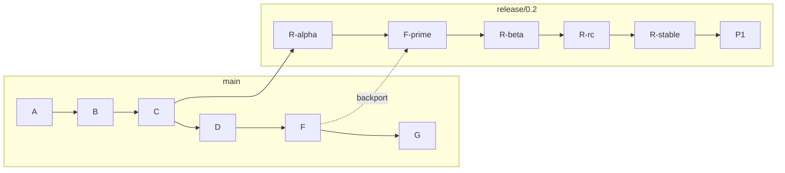
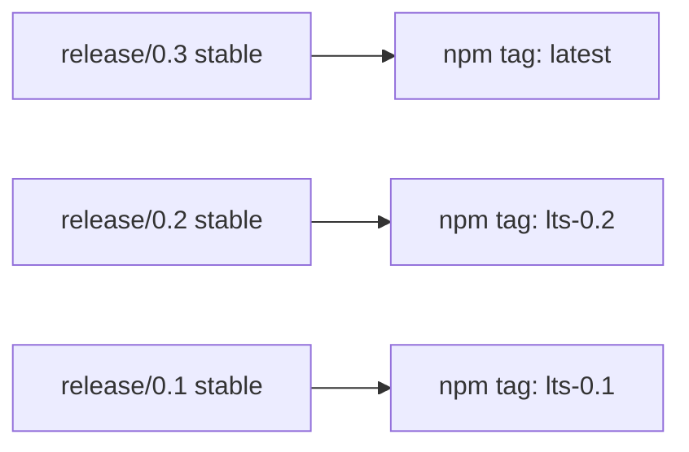
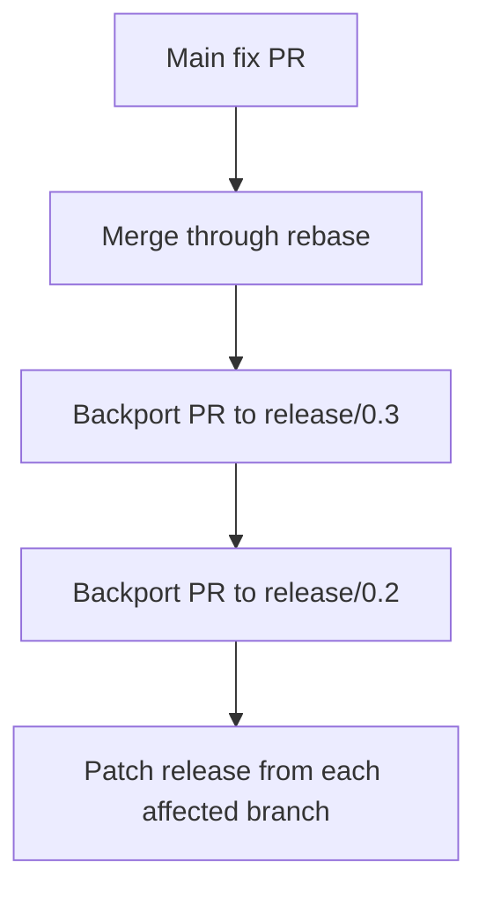
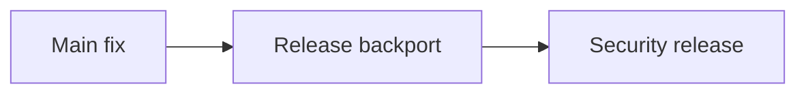

<!-- SPDX-FileCopyrightText: 2026 Hari Srinivasan -->
<!-- SPDX-License-Identifier: Apache-2.0 -->

# Axl releases

Status: implemented release process, pending the first published release

Axl publishes from protected release branches. It never publishes from `main`.

The release system has four jobs:

1. keep `main` available for forward development;
2. maintain stable release lines independently;
3. move selected fixes from `main` to release branches through traceable backport pull requests; and
4. publish identical package bytes to npm and GitHub Releases with notes, checksums, an SBOM, OpenVEX metadata, provenance, and signed tags.

The BDFL is the release authority until release duties are delegated in [GOVERNANCE.md](GOVERNANCE.md).

## Non-negotiable rules

- Never publish a release from `main`.
- Never merge a release branch back into `main`.
- Never rebase or force-push a published release branch.
- Never move or replace a published tag.
- Never republish an npm version.
- Land fixes on `main` first, then cherry-pick them onto each supported release branch.
- Use `git cherry-pick -x` so every backport records its source commit.
- Require pull requests, current branches, linear history, and required checks on `release/**`.
- Build npm and GitHub Release artifacts once and publish the same tarball to both destinations.
- Treat a release as complete only after public artifacts are downloaded and verified.

## Branch model

Axl uses one forward-development branch and one long-lived branch per maintained minor series:



`release/0.2` is cut from an exact commit on `main`. After that point:

- `main` continues toward later work;
- `release/0.2` receives release metadata and selected backports;
- `F` is the original fix on `main`;
- `F'` is a cherry-picked application of the fix on `release/0.2`;
- release tags point to commits on `release/0.2`; and
- both branches remain linear.

Rebase-only merging applies independently to each target branch. A PR targeting `release/0.2` must be rebased onto the latest `release/0.2`. It must not be rebased onto `main`.

## Release branches

Release branches use this exact pattern:

```text
release/<major>.<minor>
```

Examples:

```text
release/0.1
release/0.2
release/1.0
release/1.4
```

Do not put patch numbers or channel names in release branch names. Alpha, beta, release-candidate, stable, and patch releases for one minor line all come from the same branch.

## Release command

The primary interface is:

```bash
pnpm release
```

The interactive command offers actions appropriate for the current branch:

```text
main:
  cut
  status

release/X.Y:
  prepare
  backport
  status
  preview
```

Explicit forms are available for automation and repeatable instructions:

```bash
pnpm release -- --cut 0.2
pnpm release -- --channel alpha
pnpm release -- --channel beta
pnpm release -- --channel rc
pnpm release -- --channel stable
pnpm release -- --backport 123 --to release/0.2
pnpm release -- --status
pnpm release:preview
```

The command requires Git, GitHub CLI authentication, a clean worktree, and exact agreement with the corresponding canonical remote branch.

## Cut a release branch

Start from an up-to-date local `main`:

```bash
git switch main
git fetch upstream --prune
git merge --ff-only upstream/main
pnpm release -- --cut 0.2
```

The command:

1. verifies the worktree is clean;
2. verifies the current branch is `main`;
3. verifies local `main` exactly matches `upstream/main`;
4. rejects an invalid `X.Y` series;
5. rejects an existing remote release branch; and
6. creates `upstream/release/0.2` at the current `main` commit.

No release is published by cutting a branch. Branch creation only freezes the starting point of a maintenance line.

Check out the new line:

```bash
git fetch upstream --prune
git switch --track upstream/release/0.2
```

## Protect release branches

Repository rules must cover:

```text
release/**
```

Require:

- no deletion;
- no force pushes;
- linear history;
- pull requests;
- rebase merging only;
- current branches before merge;
- required approving reviews;
- CODEOWNERS review;
- resolved review conversations;
- required CI, CodeQL, dependency-review, DCO, REUSE, audit, and Gitleaks checks; and
- merge-queue evaluation when the repository uses a queue for the release line.

The release workflows run on pull requests, merge groups, and pushes that target `release/**`.

A release branch is never rebased onto `main` after creation. Doing so would rewrite or contaminate the maintained line.

## Channels

Axl supports four release stages:

| Stage | Version example | npm dist-tag | GitHub release type |
| --- | --- | --- | --- |
| Alpha | `0.2.0-alpha.1` | `alpha` | Prerelease |
| Beta | `0.2.0-beta.1` | `beta` | Prerelease |
| Release candidate | `0.2.0-rc.1` | `next` | Prerelease |
| Stable | `0.2.0` | `latest` or maintenance tag | Full release |

“Prerelease” is the general category. `rc` is the concrete final prerelease channel.

Valid progressions include:

```text
0.2.0-alpha.1
0.2.0-alpha.2
0.2.0-beta.1
0.2.0-beta.2
0.2.0-rc.1
0.2.0
0.2.1-rc.1
0.2.1
```

The release tool refuses to move a release core backward from beta to alpha or from rc to beta. Every published version is immutable.

## Prepare a release

Check out and update the release branch:

```bash
git switch release/0.2
git fetch upstream --prune
git merge --ff-only upstream/release/0.2
```

Run interactively:

```bash
pnpm release
```

Or select a channel explicitly:

```bash
pnpm release -- --channel beta
```

Preview without creating a branch, commit, push, or pull request:

```bash
pnpm release:preview
```

The command:

1. verifies the worktree is clean;
2. verifies the branch matches `release/X.Y`;
3. verifies local and canonical release branches are identical;
4. fetches immutable tags;
5. computes the next legal version for the chosen channel;
6. finds changes since the relevant previous tag;
7. resolves merged pull requests and backport links;
8. groups release notes by category;
9. calculates the correct npm dist-tag;
10. writes release metadata in an isolated worktree;
11. updates the npm distribution version;
12. writes `.github/release-notes.md`;
13. writes `.release.json`;
14. creates a signed-off release commit;
15. pushes `release-prep/vX.Y.Z`; and
16. opens a release-preparation PR against the current release branch.

The release-preparation PR must contain only:

```text
.release.json
.github/release-notes.md
distribution/npm/package.json
```

Unexpected files are not release metadata and must be removed from the release PR.

## Release manifest

Each release-preparation commit records a machine-readable `.release.json`:

```json
{
  "version": "0.2.1",
  "channel": "stable",
  "npmTag": "latest",
  "branch": "release/0.2",
  "previousTag": "v0.2.0",
  "cutoff": "FULL_PARENT_COMMIT_SHA",
  "createdAt": "2026-09-02T00:00:00.000Z",
  "includedPrs": [123, 128],
  "backports": [
    {
      "originalPr": 117,
      "backportPr": 123
    }
  ]
}
```

The manifest is overwritten by later release-preparation commits, but every historical copy remains available through its immutable tag.

The `cutoff` must equal the parent of the release commit after rebase. If the release branch advances while a release-preparation PR is open, regenerate or update the release metadata after rebasing. The workflow refuses a stale cutoff.

## Release notes

Release notes are written to:

```text
.github/release-notes.md
```

They are attached as the GitHub Release body and contain:

- version, channel, and source commit;
- Security;
- Features;
- Fixes;
- Documentation;
- Maintenance;
- contributors;
- exact npm installation command;
- verification instructions; and
- a comparison link.

Pull request labels and Conventional Commit prefixes determine the initial category. Review and edit the generated notes in the release-preparation PR. Generated notes are a starting point, not permission to publish inaccurate descriptions.

Stable notes compare against the preceding stable release. Prerelease notes compare against the previous applicable tag on the release line.

## Never release `main`

The release workflow triggers only on:

```yaml
push:
  branches: ["release/**"]
```

It validates that `.release.json` names the pushed release branch. A release commit on `main`, a feature branch, or an arbitrary tag is invalid and must publish nothing.

The release workflow also verifies that:

- exactly one release commit appears in the pushed range;
- the release commit updates `.release.json`;
- the manifest branch matches the pushed branch;
- the manifest cutoff equals the release commit parent; and
- the npm distribution version matches the manifest version.

## Publication targets

Axl publishes to exactly two release destinations:

1. npm as `@observal/axl`; and
2. GitHub Releases in `Observal/Axl`.

The package tarball is built once. That exact tarball is uploaded to GitHub and published to npm.

### npm

Install the current stable release:

```bash
npm install --global @observal/axl
```

Install an exact version:

```bash
npm install --global @observal/axl@0.2.1
```

Install by channel:

```bash
npm install --global @observal/axl@alpha
npm install --global @observal/axl@beta
npm install --global @observal/axl@next
```

The npm package exposes one executable:

```text
axl
```

Internal workspace packages remain private. The release build bundles Axl's internal packages into the CLI artifact while leaving declared public runtime dependencies to npm.

### GitHub Releases

Each GitHub Release contains:

```text
observal-axl-X.Y.Z.tgz
observal-axl-X.Y.Z.cdx.json
observal-axl-X.Y.Z.openvex.json
install.sh
checksums.txt
build-provenance.intoto.jsonl
```

Install the latest stable GitHub Release artifact:

```bash
curl -fsSL https://github.com/Observal/Axl/releases/latest/download/install.sh | sh
```

Install a specific version:

```bash
AXL_VERSION=v0.2.1 \
  curl -fsSL https://github.com/Observal/Axl/releases/download/v0.2.1/install.sh | sh
```

The installer:

1. verifies Node.js and npm are available;
2. enforces Node.js `^22.19.0` or `>=24.0.0`;
3. downloads the package and checksum manifest;
4. verifies SHA-256 using `sha256sum` or `shasum`;
5. installs the verified tarball globally with npm; and
6. runs `axl --version`.

## Public package construction

The tracked npm template lives at:

```text
distribution/npm/package.json
```

The public package is named:

```text
@observal/axl
```

Build locally:

```bash
pnpm build:release
pnpm build:release-metadata -- 0.2.1
```

The build:

1. bundles `packages/cli/src/main.ts` and internal workspace code;
2. embeds the release version in `axl --version`;
3. leaves public runtime dependencies external;
4. creates a clean npm staging directory under `.release/npm`;
5. copies `LICENSE`, `NOTICE`, and the npm README;
6. runs `npm pack`;
7. copies `install.sh`;
8. generates and validates a reproducible CycloneDX 1.5 runtime SBOM with npm;
9. generates an OpenVEX document; and
10. generates `checksums.txt` for the package, installer, SBOM, and OpenVEX document.

OpenVEX statements are security claims, not scanner output. The generated document contains no statements unless a maintainer has reviewed and approved each affected, fixed, not affected, or under-investigation claim. An empty statement list means Axl publishes no VEX exception claims for that release. It does not claim that no vulnerabilities exist.

Disposable `.release/` output is ignored by Git.

Smoke-test a package before publication:

```bash
pnpm build:release
root=$(mktemp -d)
npm install --prefix "$root" --ignore-scripts .release/artifacts/observal-axl-0.0.0.tgz
"$root/node_modules/.bin/axl" --version
```

## Release workflow

`.github/workflows/release.yml` runs after a release-preparation PR reaches a protected release branch.

### Preflight

- Resolve and validate the release commit.
- Install from the frozen lockfile.
- Run `pnpm check`.
- Run `pnpm audit --audit-level high`.
- Run REUSE compliance.
- Build the release package, CycloneDX SBOM, OpenVEX document, and checksums.
- Validate the SBOM and OpenVEX structure.
- Install and smoke-test the packed CLI.
- Upload the short-lived workflow artifact.

### Signed tag

- Create `vX.Y.Z` at the release commit.
- Sign the tag with gitsign and GitHub OIDC.
- Verify repository, workflow, branch, and issuer identity.
- Refuse to move an existing tag.

### npm publication

- Use the protected `npm` environment.
- Use npm trusted publishing with OIDC.
- Publish with `--provenance` and the manifest's dist-tag.
- If the version already exists, compare SHA-512 integrity and continue only when the bytes are identical.

### GitHub Release publication

- Attest the package tarball, installer, SBOM, OpenVEX document, and checksums with GitHub build provenance.
- Verify every attestation before publication.
- Create or resume a draft GitHub Release.
- Refuse to replace an asset with different bytes.
- Upload the package, installer, SBOM, OpenVEX document, checksums, and provenance bundle.
- Publish the draft once so GitHub Immutable Releases locks the tag and assets.
- Publish stable versions as full releases.
- Publish alpha, beta, and rc versions as prereleases.
- Mark only the current stable line as the latest GitHub release.

### Public verification

- Download assets from the published GitHub Release.
- Verify GitHub's immutable-release attestation for the release and every asset.
- Verify every checksum.
- Validate the SBOM and OpenVEX metadata.
- Install the downloaded tarball.
- Run `axl --version`.
- Confirm npm reports the exact version.
- Download the npm tarball and compare it byte-for-byte with the GitHub asset.

## npm stable-line policy

Only the newest stable minor line may own npm's `latest` tag.

If the newest stable release is `0.3.x`:



An older maintenance release must never move `latest` backward.

The release tool determines this from existing stable tags across all release lines and records the chosen npm tag in `.release.json`.

## Backport policy

All ordinary fixes land on `main` first.

The normal flow is:



Do not author an ordinary fix only on a release branch. That creates a hidden divergence and makes the same defect likely to return on `main`.

## Create a backport

Given merged main PR #123:

```bash
pnpm release -- --backport 123 --to release/0.2
```

The command:

1. requires a clean worktree;
2. validates the target name;
3. fetches the canonical release branch;
4. verifies PR #123 is merged to `main`;
5. reads every commit in the original PR;
6. creates `backport/0.2/123` from the latest `upstream/release/0.2`;
7. cherry-picks the commits in order with `git cherry-pick -x`;
8. preserves matching DCO trailers;
9. pushes the branch to the configured fork; and
10. opens a PR against `release/0.2`.

The backport PR body records:

```text
Backport-of: #123
Target: release/0.2
Original-commits:
- FULL_SHA
```

If a cherry-pick conflicts, the command stops loudly and preserves its worktree for manual resolution. It does not skip or hide the conflicting commit.

## Backport order

Apply a fix from newest to oldest maintained line:

```text
main
release/0.3
release/0.2
release/0.1
```

Newer lines are usually closer to `main` and reveal whether the patch applies cleanly before older compatibility differences are handled.

Each destination receives its own backport PR and CI result.

## Backport tracking

Rebase merges and cherry-picks create different commit hashes. Do not use raw SHA equality as the only record of whether a fix is present.

Use these records together:

1. The original GitHub PR number.
2. The backport PR number.
3. The `Backport-of` field.
4. `git cherry-pick -x` provenance trailers.
5. Release manifests captured by tags.
6. Branch-specific labels such as `backport/0.2-requested` and `backport/0.2-complete`.
7. Patch equivalence when an audit needs to verify the code itself.

Check patch equivalence with:

```bash
git cherry release/0.2 main
```

Or compare stable patch IDs:

```bash
git show ORIGINAL_SHA | git patch-id --stable
git show BACKPORT_SHA | git patch-id --stable
```

Matching patch IDs indicate equivalent changes even when the commits have different identities.

The PR number identifies the logical change. Commit SHAs identify particular applications of that change.

## Emergency and embargoed fixes

Preferred order remains:



If an embargo requires private release-branch work:

1. open or record a private security advisory;
2. prepare the release-branch fix privately;
3. create a required forward-port task for `main`;
4. publish the security release;
5. apply the equivalent fix to `main` immediately after disclosure;
6. compare patches; and
7. close the task only after every supported line is fixed.

Urgency does not permit mutable tags, replaced npm packages, unsigned artifacts, missing checksums, or hidden test failures.

## Release status

From `main`:

```bash
pnpm release -- --status
```

This lists canonical release branches.

From `release/0.2`:

```bash
pnpm release -- --status
```

This reports:

- release series;
- latest tag reachable from the branch;
- count of unreleased commits; and
- unreleased commit subjects.

Use status before preparing a release and after merging backports.

## Release branch lifecycle

A release branch remains while its series is supported.

When support ends:

- publish an end-of-support notice;
- ensure the final tag and artifacts remain available;
- remove the branch from active support documentation;
- stop accepting backports; and
- retain the branch unless repository policy explicitly archives it another way.

Do not delete a release branch merely because the next minor line exists.

## Failure and retry behavior

The release process is designed to fail loudly.

### Release preparation failure

The command preserves `.worktrees/release-vX.Y.Z` if preparation, push, or PR creation fails. Inspect the worktree, correct the cause, and either resume carefully or remove the worktree and branch before retrying.

### Backport conflict

The command preserves `.worktrees/backport-X.Y-N`. Resolve conflicts there, continue the cherry-pick, run checks, and push the backport branch. Do not rerun blindly while the preserved branch exists.

### Existing npm version

The workflow calculates local SHA-512 integrity and compares it with npm. Identical bytes allow a safe retry. Different bytes stop publication.

### Existing GitHub asset

The workflow downloads the existing asset and compares bytes. Identical assets allow a safe retry. Different assets stop publication. The workflow never silently clobbers them.

### Existing tag

The workflow verifies that the tag points to the expected commit and carries a valid gitsign signature. A tag pointing elsewhere is a hard failure.

## Repository setup before first release

Configure these settings outside the repository:

- Create the npm organization or scope ownership for `@observal`.
- If `@observal/axl` does not exist, create one short-lived granular npm token with the narrowest available `@observal` publish scope and store it as the protected `NPM_BOOTSTRAP_TOKEN` environment secret.
- Publish the first package through the release workflow from `release/X.Y`, never from a workstation or `main`.
- Configure npm trusted publishing for organization `Observal`, repository `Axl`, workflow `release.yml`, and environment `npm` immediately after the package exists.
- Delete `NPM_BOOTSTRAP_TOKEN` and revoke the bootstrap token before the next release.
- Create a protected GitHub environment named `npm`.
- Restrict that environment to `release/**`.
- Apply branch rules to `release/**`.
- Apply immutable signed-tag rules to `v*`.
- Keep repository write access narrow. If tag creation must be restricted below repository write access, install a dedicated release GitHub App and make it the only creation bypass.
- Enable GitHub Immutable Releases and artifact attestations.
- Enable secret scanning and push protection.
- Confirm required checks run for release-target pull requests and merge groups.

The bootstrap token is a one-release exception forced by npm's requirement that a package exist before its trusted publisher can be configured. Never use a long-lived npm token when OIDC trusted publishing is available.

## First-release gate

Axl must not publish its first release until:

- [ ] `@observal/axl` ownership and trusted publishing are configured.
- [ ] The `npm` environment is protected.
- [ ] `release/**` branch rules are active.
- [ ] `v*` tag rules and GitHub Immutable Releases are active.
- [ ] Every GitHub Action is pinned to a full commit SHA.
- [ ] `pnpm check` passes.
- [ ] `pnpm audit --audit-level high` passes.
- [ ] `reuse lint` passes.
- [ ] `pnpm build:release` produces the expected tarball.
- [ ] `pnpm build:release-metadata -- X.Y.Z` produces a valid CycloneDX SBOM, OpenVEX document, and checksum manifest.
- [ ] A temporary install of the tarball reports the expected version.
- [ ] A release candidate completes the full workflow.
- [ ] The signed tag verifies against the release workflow and branch identity.
- [ ] GitHub provenance verifies before publication.
- [ ] The SBOM and OpenVEX assets are present, valid, checksummed, and attested.
- [ ] npm provenance is present.
- [ ] GitHub and npm package bytes are identical.
- [ ] Release notes are reviewed.
- [ ] User verification commands are tested.
- [ ] Failure recovery is exercised without replacing published bytes.

Until this gate passes, [the verification guide](docs/security/release-verification.md) must state that Axl has no published release.

## Maintainer checklist

Before cutting a branch:

- [ ] `main` is clean and matches `upstream/main`.
- [ ] The selected cutoff contains the intended feature set.
- [ ] The release series does not already exist.
- [ ] The release-branch ruleset is ready to cover the new branch.

Before preparing a release:

- [ ] The local release branch matches upstream.
- [ ] Required main fixes have backport PRs.
- [ ] Backport PRs have merged and passed CI.
- [ ] The selected channel is correct.
- [ ] Generated notes identify every user-visible change.
- [ ] The npm tag will not move `latest` backward.

Before merging release preparation:

- [ ] The manifest cutoff equals the latest release-branch commit.
- [ ] The package version matches the manifest.
- [ ] The release notes are accurate.
- [ ] Required checks pass against the release branch.
- [ ] The release commit is signed off.

After publication:

- [ ] The tag signature verifies.
- [ ] GitHub's immutable-release attestation verifies for the release and every asset.
- [ ] GitHub provenance verifies.
- [ ] Checksums verify.
- [ ] The CycloneDX SBOM describes the published package and exact version.
- [ ] Every OpenVEX statement, if any, has documented human review.
- [ ] npm reports the exact version and intended dist-tag.
- [ ] GitHub marks the correct release as latest or prerelease.
- [ ] Installing from npm works.
- [ ] Installing the GitHub tarball works.
- [ ] Every included backport is recorded in `.release.json`.
- [ ] No supported release line is missing a required security fix.
