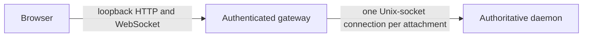
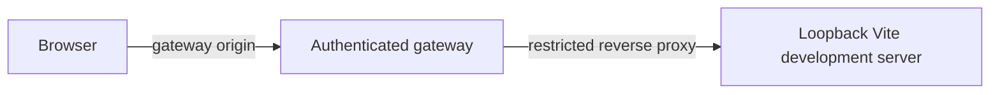

<!-- SPDX-FileCopyrightText: 2026 Hari Srinivasan -->
<!-- SPDX-FileCopyrightText: 2026 VishnuM449 -->
<!-- SPDX-License-Identifier: Apache-2.0 -->

# Web gateway security specification

Status: security specification supporting [the local web client architecture](web-client.md)

## Scope

This document defines the localhost browser threat model, launch authentication, HTTP policy, WebSocket limits, development routing, logging, and security acceptance tests.

## Boundary

The gateway is a thin local process:



It serves assets and bridges validated protocol messages. It contains no session, agent, model, workspace, or Git behavior.

Loopback binding is necessary but is not authentication.

## Protected assets

- authority to send, interrupt, configure, or dispose sessions
- canonical events and model-visible content
- source files and Git changes
- interaction and future permission decisions
- daemon and gateway availability
- launch and browser credentials

## Attackers

- a malicious website open in the browser
- DNS rebinding to the loopback server
- another local process without Axl authority
- untrusted repository and tool content rendered by the app
- oversized, flooding, stalled, or slow clients
- accidental disclosure through logs, history, referrers, caches, errors, or development tooling

A privileged process that can inspect another process or browser memory is outside this boundary. A normal same-user process that can make loopback requests is not trusted.

## Binding and canonical origin

The gateway binds only to an operating-system loopback address. It never binds to wildcard, LAN, externally routed, or implicitly forwarded addresses.

It selects one IP-literal origin, for example:

```text
http://127.0.0.1:43127
```

It does not rely on a DNS hostname.

Every request must carry the exact selected `Host`. Absolute-form targets and forwarded headers do not override it. Invalid hosts receive a fixed response with no protected content.

Every authenticated HTTP request and WebSocket upgrade must carry the exact selected `Origin`. Missing, `null`, file, extension, alternate-port, alternate-loopback-name, and suffix-matched origins are rejected. CORS is disabled.

## Launch authentication

At startup the gateway creates a launch token with at least 256 bits from the platform cryptographic random generator.

The launch token is:

- one use
- valid for 60 seconds
- replaced after exchange
- revoked at gateway shutdown
- rotated by restarting the gateway
- never accepted in a query string, cookie, WebSocket subprotocol, or normal API request
- never written to persistent browser storage
- never logged

When automatically opening a browser, `axl web` places the launch token in the URL fragment. Fragments are not sent in HTTP requests or referrers. The bootstrap page:

1. reads the fragment once
2. removes it immediately with `history.replaceState`
3. sends it in the body of a same-origin `POST /auth/exchange`
4. clears the in-memory value

Normal terminal output prints the token-free origin. A token-bearing manual command is shown only when explicitly requested.

## Browser credential

A successful exchange returns a random browser credential in a cookie with:

- at least 256 bits of entropy
- `HttpOnly`
- `SameSite=Strict`
- host-only scope
- a process-random path prefix
- a maximum 12-hour lifetime
- revocation when the gateway exits
- rotation whenever the gateway restarts

The credential is unavailable to application JavaScript. If the selected browser cannot apply the required cookie behavior on the loopback origin, startup fails rather than weakening the policy.

Cookies are not port-scoped. The gateway creates a random authenticated path prefix with at least 128 bits of entropy and scopes the cookie, authenticated HTTP endpoints, and WebSocket endpoint to it. The prefix is routing isolation, not sufficient authentication by itself. An unrelated service on another loopback port cannot guess a matching request path to receive the cookie.

A WebSocket upgrade requires the valid cookie, exact Host, exact Origin, and process path prefix.

## Development origin

Development uses the same gateway origin as production:



The browser never loads application assets or opens development WebSockets directly against a second Vite origin.

Development mode is explicit. The gateway validates the configured Vite target as loopback, reverse-proxies only known asset and hot-reload paths, and keeps authentication and Host/Origin checks active. It prints a development warning.

The gateway does not trust headers returned by Vite. It applies its own security and cache headers at the browser boundary. Production never starts or falls back to Vite.

## HTTP policy

All responses use explicit content types and these headers:

```text
Content-Security-Policy: default-src 'self'; script-src 'self'; style-src 'self'; img-src 'self' blob: data:; connect-src 'self'; object-src 'none'; base-uri 'none'; form-action 'self'; frame-ancestors 'none'
X-Content-Type-Options: nosniff
Referrer-Policy: no-referrer
Cache-Control: no-store
Cross-Origin-Opener-Policy: same-origin
Cross-Origin-Resource-Policy: same-origin
```

Production HTML has no inline script or style. Development changes only what Vite hot reload requires at the same gateway origin. It does not use wildcard source or origin rules.

Repository content, event text, Markdown, filenames, and tool output are untrusted text. Raw HTML is disabled until a later reviewed sanitizer contract exists.

Static production assets use content hashes, but authenticated responses and HTML remain `no-store`. The packaging specification defines asset verification.

## WebSocket limits

Initial limits are:

- handshake timeout: 5 seconds
- idle timeout without heartbeat: 60 seconds
- maximum text frame: 1 MiB
- maximum assembled fragmented message: 1 MiB
- binary frames: rejected
- compression: disabled
- pending requests per attachment: 64
- inbound messages: 100 per rolling 10 seconds
- inbound burst: 20
- outbound queued bytes per attachment: 4 MiB
- outbound queued messages per attachment: 1,024
- browser attachments per gateway: 16

Control frames retain the standard's smaller limits.

Protocol snapshot paging keeps ordinary frames within these ceilings. `MAX_CANONICAL_EVENT_BYTES` measures the exact persisted UTF-8 event JSON and leaves at least 256 KiB for the delivery envelope, cursor, subscription identity, and framing within a 1 MiB message. A frame that would exceed the assembled limit fails before write; it is never fragmented into an oversized message.

Large files, artifacts, and media use bounded workspace pages or schema-defined blob references. The gateway never converts an oversized event into a blob, truncates it, or retries it with different semantics.

Malformed JSON, invalid protocol messages, binary data, messages before authentication, or repeated rate-limit violations close the connection. Ordinary structured RPC errors do not.

## Backpressure and slow clients

When either outbound queue limit is reached, the gateway pauses daemon reads for that attachment. Other attachments continue independently.

If the queue does not fall below half the limit within 10 seconds, the gateway closes the slow attachment with a specific close reason. It does not discard queued events or block the daemon globally. The client reconnects from its last acknowledged cursor.

Handshake, idle, and queue timers use monotonic time. Limits are hard ceilings and cannot be widened by browser input.

## Attachment scope

The local browser receives `local_control` only after gateway authentication and daemon initialization. Browser-supplied client identity is diagnostic and does not grant scope.

Remote observer and steering credentials are deferred. The gateway does not expose a LAN mode or hidden remote flag in this slice.

One browser attachment maps to one daemon connection. Disconnect cleanup removes its subscriptions and presence without changing session runtime state.

## Logging and errors

Gateway logs may include:

- startup and shutdown state
- loopback address and port
- asset version
- attachment IDs
- generated correlation IDs
- method names
- bounded error codes
- byte counts and durations

They must not include:

- launch tokens or cookies
- Cookie or Authorization headers
- token-bearing fragments or URLs
- prompt, event, or interaction content
- workspace files or Git diffs
- provider credentials
- protected environment values

Validation errors identify safe field paths and stable reasons. They do not echo rejected values that may be secret-bearing.

Error pages are fixed templates. They do not include stack traces, request headers, environment data, or Vite internals.

## Shutdown

Stopping the gateway:

1. stops accepting HTTP and WebSocket connections
2. closes browser attachments
3. clears browser credentials and launch tokens
4. closes its Unix-socket daemon connections
5. exits without interrupting or disposing daemon sessions

Closing a browser tab has the same attachment-only effect for that tab.

## Security acceptance tests

Automated tests must prove:

1. The gateway listens only on loopback.
2. Invalid and ambiguous Host values receive no protected content.
3. Missing, null, and alternate Origin values cannot authenticate or upgrade.
4. A launch token has at least 256 bits, is one-use, expires, and is absent from query strings, persistent storage, and logs.
5. Bootstrap code removes the fragment before application startup.
6. The browser cookie is HttpOnly, SameSite Strict, host-only, path-scoped, and process-scoped.
7. Another loopback port cannot obtain the cookie through normal browser requests.
8. WebSocket upgrades require cookie, Host, Origin, and path prefix.
9. CSP, frame denial, nosniff, no-referrer, no-store, and cross-origin isolation headers are present.
10. Development browser traffic remains on the gateway origin.
11. Oversized and fragmented messages cannot exceed the assembled limit.
12. Binary frames and compression are disabled.
13. Floods, stalled handshakes, idle clients, and slow readers are evicted without affecting another attachment.
14. Browser-facing messages receive runtime protocol validation.
15. A maximum-size canonical event fits with its complete delivery envelope, while an oversized event fails before transmission.
16. Logs and errors contain no token, cookie, protected content, or rejected secret value.
17. Closing the gateway or tab does not interrupt or dispose sessions.
18. Missing required controls fail startup rather than downgrade.
