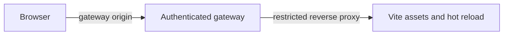

<!-- SPDX-FileCopyrightText: 2026 Hari Srinivasan -->
<!-- SPDX-FileCopyrightText: 2026 VishnuM449 -->
<!-- SPDX-License-Identifier: Apache-2.0 -->

# Web build and packaging specification

Status: packaging specification supporting [the local web client architecture](web-client.md)

## Scope

This document defines web dependencies, development asset routing, production builds, asset compatibility, release inclusion, and CI gates.

## Dependencies

React and Vite are approved as the only initial web production dependencies. Install only the minimum packages required for the first application shell.

The application starts without a global state framework. SDK projections and React-local state own initial UI state. Any additional production dependency requires approval.

All versions are pinned through the pnpm lockfile and included in normal dependency review and audit checks.

## Package boundary

The web application lives in `packages/web` when implementation begins. It may import:

- public `packages/sdk` exports
- public `packages/protocol` types re-exported by the SDK where appropriate
- React application dependencies

It must not import daemon, kernel, provider, sandbox, TUI, or private SDK internals.

The application contains no agent loop, direct workspace access, Git invocation, provider credential, or alternate protocol parser.

## Development mode

Development mode is explicit:

```text
axl web --dev
```

The Vite server and gateway both bind to loopback. The browser always loads the gateway origin:



The browser does not connect directly to a separate Vite origin. This keeps Host, Origin, cookie, CSP, and WebSocket authentication consistent with production.

The gateway:

- validates that the configured Vite target is loopback
- proxies only known development asset and hot-reload paths
- keeps launch authentication active
- rewrites no session RPC
- applies gateway security headers at the browser boundary
- prints a clear development-mode warning

Development startup fails if the Vite target is missing or incompatible. Normal `axl web` never starts Vite, a package manager, or a development fallback.

## Production build

Vite emits content-hashed JavaScript and CSS with a manifest. Production HTML has no inline scripts or styles.

The build emits metadata:

```ts
interface WebAssetMetadata {
  readonly webAssetVersion: number;
  readonly packageVersion: string;
  readonly sourceRevision: string;
  readonly wireVersion: number;
  readonly entrypoints: readonly string[];
  readonly sha256: Readonly<Record<string, string>>;
}
```

`webAssetVersion` versions metadata and asset-loading behavior. `wireVersion` binds the application to the daemon contract compiled into its SDK.

The production build:

1. builds `packages/protocol`
2. builds `packages/sdk`
3. builds `packages/web` against that exact SDK and wire version
4. hashes every emitted asset
5. writes and verifies the Vite manifest and Axl metadata
6. includes the immutable directory in the CLI release artifact
7. tests the installed artifact rather than only source-tree output

The release uses no CDN and downloads no runtime application code.

## Gateway verification

Before listening, a production gateway verifies:

- asset metadata exists and parses
- metadata version is supported
- package and wire versions are compatible
- every declared entrypoint exists
- every declared asset hash matches
- no undeclared executable entrypoint is selected

Missing assets, missing entrypoints, hash mismatch, incompatible metadata, or wire mismatch fails startup loudly.

The gateway never serves source-tree development files in production and never falls back to stale assets.

## Cache policy

Content-hashed static files may use immutable internal cache semantics, but the gateway security boundary applies `no-store` to authenticated responses and the HTML bootstrap. Browser correctness must not depend on retaining an old asset after gateway restart.

The HTML entry references only assets in the verified manifest. It does not construct filenames from browser input.

Source maps are excluded from release artifacts unless a later release policy explicitly includes and audits them.

## CLI artifact

The CLI release artifact contains:

- gateway runtime code
- verified production asset directory
- asset metadata and manifest
- the matching protocol and SDK runtime

`axl web`:

1. validates assets
2. connects to or starts the local daemon
3. binds the loopback gateway on an available port
4. prints the token-free URL
5. optionally opens the authenticated launch URL
6. leaves active sessions running when the browser or gateway detaches

Packaging must work from the installed artifact without the repository, Vite, pnpm, or development source files.

## Version changes

A wire change requires rebuilding assets. An asset metadata change increments `webAssetVersion`. Package release metadata records both.

An old browser page reconnecting to a newer gateway receives an explicit incompatibility state and reload instruction. It does not continue with a partially compatible SDK.

## Accessibility and browser tests

The first application shell includes structural accessibility rather than deferring it to visual polish:

- semantic navigation, tabs, buttons, dialogs, and status regions
- visible focus and logical tab order
- keyboard operation for sessions, tabs, composer, and dialogs
- defined Escape behavior
- screen-reader labels and live connection announcements
- reduced-motion support
- no color-only meaning
- one primary pane on narrow windows
- composer and interrupt access on narrow windows

Real-browser tests cover these behaviors against packaged production assets as well as development mode.

## CI checks

Later implementation slices add:

- web formatting, lint, and type checking
- production build
- SDK and projector unit tests
- browser end-to-end tests
- accessibility automation
- gateway security tests
- asset hash and metadata verification
- installed-artifact smoke tests
- package-boundary checks
- lockfile audit and dependency review

CI verifies that production code cannot import Vite development entrypoints or daemon and kernel internals.

## Reproducibility and provenance

The build records the source revision and locked package versions. Release SBOM and provenance work follows the repository release plan. The metadata itself contains no credential, local absolute path, build-host identity, or timestamp that would prevent reproducible output without a documented reason.

## Acceptance criteria

- React and Vite are the only initial web production dependencies.
- The browser uses the gateway origin in development and production.
- Production starts no development server and performs no network download.
- Every production asset is content-hashed and declared.
- The gateway rejects missing, altered, or incompatible assets before listening.
- The installed CLI artifact serves the same tested assets built in CI.
- A stale browser detects wire or asset incompatibility explicitly.
- Source maps are absent unless separately approved.
- Boundary checks prevent private daemon and kernel imports.
- Browser and accessibility tests run against the packaged build.
